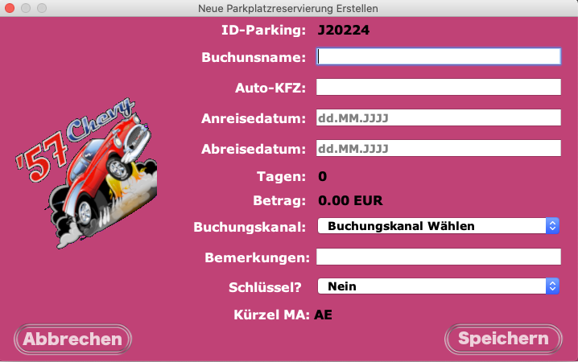
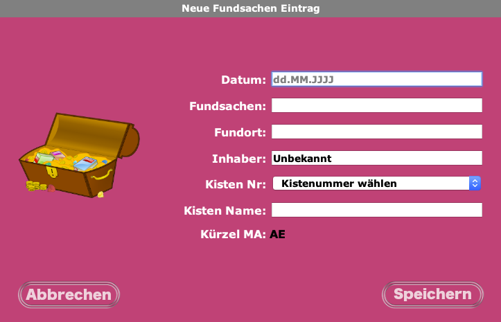

# Java Application for local database storage

## Application that allows you to create databases on a disk located on a local internal server.

The path to the local database for all computers with access to the hard drive on the local server is the same as specified in the application configuration file.

We have the following databases: 

* Parking(Rent parking places);
* Fundsachen(Lost and Found);
* Fitness Abo(Fitness subscription);
* Uebergabe(shift transfer);
* Telefonbuch(Phone book).

Created especially for Airport Hotel Basel: [Airport Hotel Basel](https://www.airporthotelbasel.com/)

 

  

### Description

This application will save databases to a disk on a local server. Local server that can be accessed from multiple computers.

I use the Apache Derby database engine in this application, MVC and DAO Pattern.

The purpose of this application is only to allow access to local databases and not on an external online server. But it must be possible to access from several computers working with the same hard drive for access to files on a local server.

The information we access is internal information of the hotel. 

 

### **Parking Reservations**

When the owner of a car comes to the hotel and parks his car in the underground parking, he presents himself at the reception to receive a ticket that must be introduced inside the car that serves as a control receipt that it was paid for the parking until the date he is coming back to pick up his car. We keep in a database the date when the customer parked his car and when he comes to pick it up.

We save in the database, the number of the car, the full name of the client, the site where the client paid the parking online, and if is not paid yet. We offer the option to pay at the reception, provide the parking ticket and we save all those informations in the database.

When the customer comes to pick up his car. We check the data to be sure he has paid. If he has paid he can validate the departure ticket at the reception.

If we do not find any information in the database, we request payment before validating the ticket.

This database for parking is used to control the payments of customers who comes to park at the hotel.

  

### **Lost and Found Database**

We store in Lost and Found Database,  information about forgotten items in the rooms. We save the name of the guest who has been in the room, the items that were found and the date they were found. When the guest calls or writes an email asking if their articles were found, we access this database to see if we found the items the guest mentions or not.

  

### Fitness Subscriptions Data Base

In the fitness database, we store subscriptions and payments of customers who want to access our gym.

  

### **Uebergabe(change of work shift) Database.**
we keep in the database all the important information in which we have to be careful with the work shift change.

for example:

* if a person comes with a free parking offer;
* if a staff of a company comes to repair or change the coffee machine;
* if a guest is going to check-in too late;
* etc.

  

### **Telefon-Book Database.**

In the telephone database, we store the important phone numbers of the staff or contacts of companies that offer services to the Hotel. In case the hotel program and the online server fails, we can always have access to this valuable information.

  

The main idea of creating a program like this, to access local data, was due to technical problems that we were having with the copy and paste of excel files where this information was saved on the disk on the local server. 

The files did not match, they were not identical, the information was lost over time and there was no exact control of the data.

  
### **Additional description.**

This program is intended to allow all local computers to access the same database. 

When the program starts for the first time, a path must be selected where the different databases will be saved. 

  

### **primary steps with first application boot.**

 

1. With the first boot, the program will request to set a path where is gonna be saved the difference local databases.

2. You will be asked to create an administrator user who is responsible for creating the other users with their respective passwords that can be modified later. 

3. After the administrator user has been created, the program will ask you to log in with your username and password

 

All configuration information is saved in a properties file in the program root. 

Each time the program starts it will check if this configuration file exists. 

In case the configuration file does not exist, the program will know that it is the first time it starts and has to be configured.

If some smart person gives you the idea of **deleting the configuration file intentionally**, trying to make **bad experiments with the configuration file**, or **delete it intentionally or unintentionally** because this person is thinking about world fisheries day and not in his task **then you will have to configure the users again.** 

**May be, it would be a very good idea to make a backup of the databases.**

<h3>Screenshop Application</h3>

 

<figure>

<figcaption>Main GUI and Login.</figcaption>
</figure>

<figure>

<figcaption>Parking GUI.</figcaption>
</figure>

<figure>

<figcaption>Add New Parking GUI.</figcaption>
</figure>

<figure>

<figcaption>Lost And Found GUI.</figcaption>
</figure>

<figure>

<figcaption>Add new Lost And Found GUI.</figcaption>
</figure>

